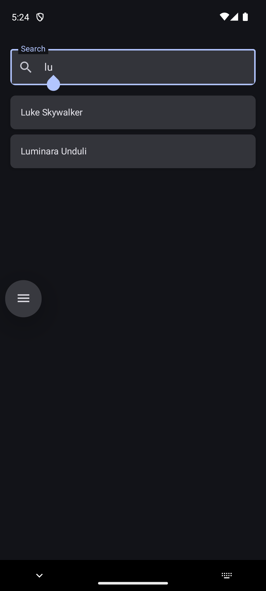
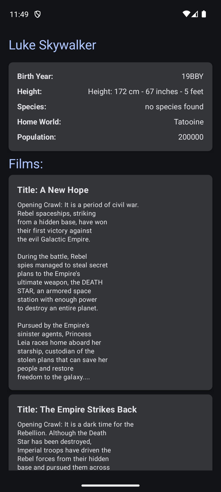

# SnappFoodTask

This project is a task developed for a Snap Food interview.
## Screenshots
<div style="display: flex; gap: 10px;">
  
  
</div>

## Features

- **Modular Architecture**: The project is organized into distinct modules:
    - `app`: Contains the main application components.
    - `core`: Includes core functionalities and utilities.
    - `feature`: Encompasses specific features of the application.
    - `build-logic`: Handles the build configurations and logic.

## Module Details

### `app` Module
- Acts as the entry point of the application.
- Contains the `MainActivity` and `NavHost` setup for navigation.
- Handles application-wide configurations such as dependency injection initialization.
- Provides a seamless integration between feature modules.

### `core` Module
- Centralizes shared utilities, resources, and helper classes.
- Includes commonly used extensions for `View`, `Context`, or `LiveData`.
- Houses base classes for repositories, and networking.
- Contains shared styles, themes, and drawable resources to ensure consistent UI.

### `feature` Module
- Designed for feature-specific development.
- Each feature is encapsulated in its own package, containing:
    - ViewModel: Manages UI state and logic for the feature.
    - UI components: Composable functions or fragments for feature-specific screens.
    - Repository: Handles data fetching and manipulation for the feature.
- Encourages isolated development, testing, and maintenance of features.

### `build-logic` Module
- Centralizes all Gradle build logic and scripts to simplify project configuration.
- Uses Kotlin DSL for better type safety and readability.
- Manages dependencies, versioning, and plugin configurations for all modules.
- Ensures consistent build setup across the project.

## Technologies Used

- **Kotlin**: The primary programming language used.
- **Gradle**: For build automation, utilizing Kotlin DSL.

## Getting Started

To get a local copy of the project up and running, follow these steps:

### Prerequisites

- **Android Studio**: Ensure you have the latest version installed.
- **JDK**: Java Development Kit 8 or higher.

### Installation

1. **Clone the repository**:

   ```bash
   git clone git@github.com:mrb1373/SnappFoodTask.git
   ```

2. **Open the project** in Android Studio:
    - Navigate to `File` > `Open...` and select the cloned repository folder.

3. **Build the project**:
    - Click on `Build` > `Rebuild Project` to ensure all dependencies are downloaded and the project is set up correctly.

## Usage

After setting up, you can run the application on an emulator or a physical device:
- Connect your device or start an emulator.
- Click on the `Run` button in Android Studio or press `Shift + F10`.
